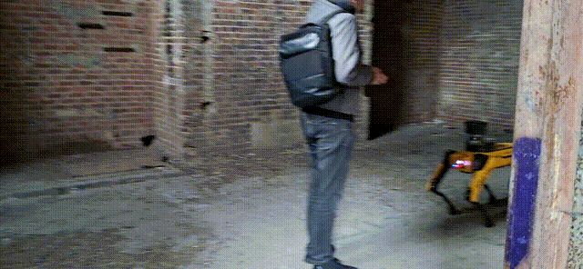
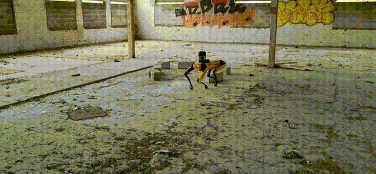

# Spot AI Vision Detection

Détection du robot quadrupède Boston Dynamics **Spot** par apprentissage
profond, dans le cadre du projet **FILDARIANE**.

Ce dépôt implémente un détecteur YOLOv8m entraîné selon une approche
*Teacher–Student* : un modèle de fondation (Grounding DINO) annote
automatiquement des frames issues du DARPA Subterranean Challenge, ces
annotations sont validées manuellement, puis un YOLOv8m est entraîné
dessus. Le modèle final sert de **brique de redondance** dans un système
de tracking visuel principalement basé sur des marqueurs AprilTag.

## Démonstration

Détection en environnement réel (crédit : vidéos CRIStAL) :



*Vidéo 1 — caméra mobile, opérateur proche, éclairage variable.
Configuration : `track`, `conf=0.7`, `max_det=1`, `iou=0.1`.*



*Vidéo 2 — conditions nominales. Configuration : `track`,
`conf=0.5`, `max_det=1`, `iou=0.1`.*

## Aperçu du pipeline

```
Vidéos DARPA  ──┐
                ├──► Extraction frames (1 FPS)  ──► Grounding DINO  ──► Validation manuelle  ──► Entraînement YOLOv8m
Clips BD Spot ──┘                                  (Teacher, zero-shot)                          (Student)
```

## Installation

```bash
git clone https://github.com/[username]/spot-AI-vision-detection.git
cd spot-AI-vision-detection
pip install -r requirements.txt
```

Pour relancer l'annotation Grounding DINO (étape optionnelle, le dataset
annoté peut être régénéré) :

```bash
pip install -r scripts/requirements-annotate.txt
```

Prérequis système : `ffmpeg`, `yt-dlp`, GPU CUDA recommandé pour
l'entraînement et l'annotation DINO.

## Utilisation

### Inférence à partir du modèle pré-entraîné

```python
from ultralytics import YOLO

model = YOLO("models/best.pt")  # téléchargé séparément, voir models/README.md
results = model.predict("path/to/image.jpg", conf=0.5)
results[0].show()
```

### Reproduction complète du pipeline

Voir [`data/README.md`](data/README.md) pour la régénération du dataset,
puis [`notebooks/train_yolov8m.ipynb`](notebooks/train_yolov8m.ipynb)
pour l'entraînement.

## Structure du dépôt

```
spot-AI-vision-detection/
├── scripts/                 Pipeline numéroté (téléchargement, extraction, annotation)
├── notebooks/               Notebook d'entraînement YOLOv8m
├── configs/                 Configurations YOLO
├── models/                  Pointeur vers les checkpoints (hébergés sur HF Hub)
├── data/                    Données régénérables (vide à l'état initial)
├── results/                 Métriques et figures finales
├── archive/                 Première approche (composite Roboflow), abandonnée
└── docs/images/             Illustrations du README
```

## Historique

Une **première approche** par agrégation de datasets Roboflow a été
explorée puis abandonnée après diagnostic d'un biais structurel
(sur-représentation des décors par rapport au robot). Le code et les
résultats de cette première phase sont conservés dans [`archive/`](archive/)
pour la traçabilité du diagnostic. L'approche actuelle (Teacher–Student
sur les vidéos DARPA) en découle directement.

## Contexte du projet

FILDARIANE est une preuve de concept portée par l'IRCICA en
collaboration avec les plateformes PRETIL et PIRVI de CRIStAL et la
plateforme ΣCom de l'IEMN. Le projet vise à maintenir un lien de
communication continu entre un opérateur et un robot explorateur en
milieu contraint (carrières souterraines de Lezennes), par déploiement
automatisé d'une chaîne de relais radio. Le présent dépôt couvre
spécifiquement la **détection visuelle du Spot** par un robot
compagnon (Robotnik Summit XL) chargé du largage des relais.

## Auteur

Ronan Le Guenne — Stage Polytech Lille / CRIStAL — 2026
Encadrant : M. Gérald Dherbomez

